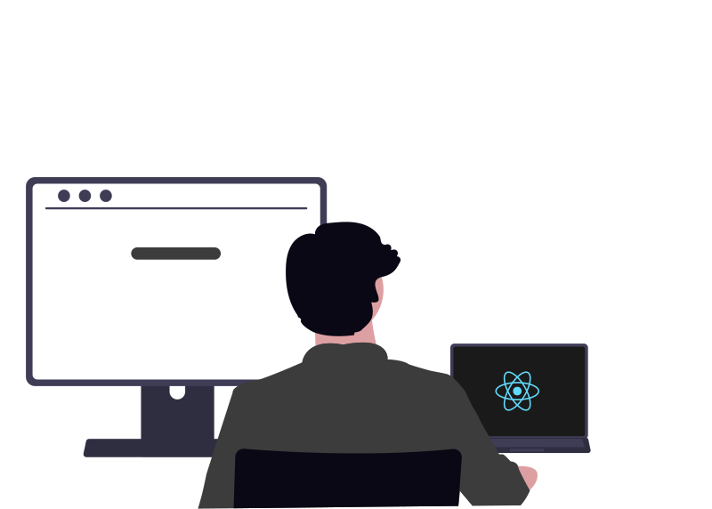

  

  
👨🏻‍💻 Me chamo Rafael, tenho 21 anos e sou um desenvolvedor em evolução.

  
🚀 Atuando como <b>Desenvolvedor Fullstack</b>, com foco no aprimoramento constante das minhas habilidades em <b>Frontend</b>.

  
📚 Paralelamente, estou <b>dedicando meus estudos ao Backend</b>, mergulhando no ecossistema <b>.NET e C#</b>.

  
  

 

  
  &nbsp;
  

 

  
  &nbsp;
  
  &nbsp;
  

